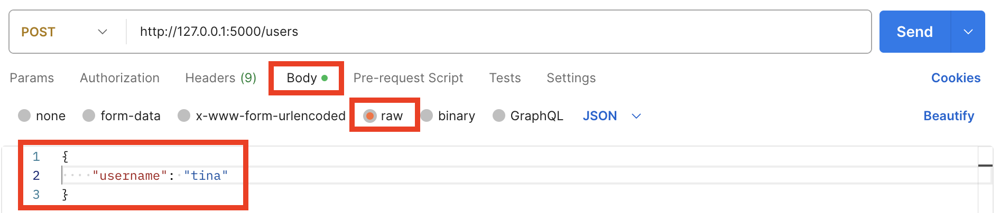

# Untested Flask App

This codebase is for use in the web applications pairing challenges.

## Setup

1. Clone this repo
2. Install the dependencies
3. Activate your virtual env

## Exploration

1. Run the app
2. Use Postman to send some requests
   - `GET "http://127.0.0.1:5000/users/"` should return a list of all the users
   - `GET "http://127.0.0.1:5000/users/1"` should return the user with an `id` of `1`. What happens if you use an `id`, like `100`, that doesn't correspond to an existing user?
   - `POST "http://127.0.0.1:5000/users"` can be used to create new user - [you'll need to provide params](#params). What happens if you omit the params?
   - `PUT "http://127.0.0.1:5000/users/1"` can be used to update a user - [you'll need to provide params](#params). What happens if you omit the params and / or use an invalid `id`?
   - `DELETE "http://127.0.0.1:5000/users/1"` will delete the user with an ad of `1`

> As you run each request, observe the response - this will come in handy when you start to write tests

### Params

For this application, the required _params_ are the same for both creating and updating a user.

After creating a new request in Postman, click on the `Body` tab and then the `raw` radio button. To the right of the radio buttons, you should then see a dropdown menu - choose `JSON`.

> NOTE: Postman can behave a bit weirdly at this point so, even if `JSON` already appears to be selected, click on the dropdown and select it anyway.

Then, in the field below, you can add your params in JSON format. For example...

```json
{
  "username": "tina"
}
```

Here's how all of that looks in Postman...


